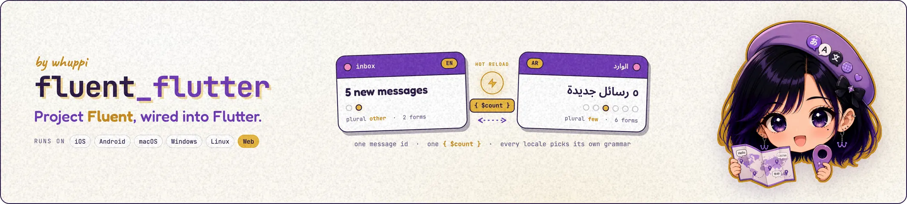

<!--
  Banner stays <picture> for GitHub's dark/light rendering. pub.dev strips
  <picture> when sanitizing the README and falls back to the inner 
  (the light variant) — which renders fine there. The heavy *-3x.png
  sources stay tracked in git; only the optimized *-web-min.webp files
  ship in the pub archive (see .pubignore). Drop the <picture> wrapper
  once pub.dev renders it. Tracking: dart-lang/pub-dev#5923.
-->
<p align="center">
  <picture>
    <source media="(prefers-color-scheme: dark)"  srcset="assets/fluent_flutter-banner-dark-web-min.webp">
    <source media="(prefers-color-scheme: light)" srcset="assets/fluent_flutter-banner-light-web-min.webp">
    
  </picture>
</p>

<p align="center">
  <a href="https://pub.dev/packages/fluent_flutter"></a>
  <a href="https://pub.dev/packages/fluent_flutter/score"></a>
  <a href="https://pub.dev/packages/fluent_flutter/score"></a>
  <a href="https://github.com/whuppi/fluent_flutter"></a>
  <a href="LICENSE"></a>
</p>

[`fluent_bundle`](https://pub.dev/packages/fluent_bundle) with the Flutter parts added. Your `.ftl` files load from assets and are found for you. One controller decides the current language — following the device, or set by the user, and switchable while the app runs. A standard `LocalizationsDelegate` plugs into `MaterialApp`, and `context.fluent` reads messages anywhere in your widgets. Translator-written markup becomes styled, tappable text, and editing an `.ftl` file updates on hot reload.

Every piece can be swapped — your own file loader, your own formatting backend, your own generated Dart class — and each works without the others.

> **Start here for a Flutter app.** Building pure Dart — a command-line tool, a server? Use [`fluent_bundle`](https://pub.dev/packages/fluent_bundle) directly; everything here is the Flutter layer on top of it.

> **Status:** 0.x. The API can change between minor versions until `1.0.0` — pre-1.0, the minor is the breaking axis, so pin `^0.N.0` and read the changelog on minor bumps.

> like it? a [⭐ star](https://github.com/whuppi/fluent_flutter) or [👍 like](https://pub.dev/packages/fluent_flutter) is the entire marketing budget. [Bugs & features →](https://github.com/whuppi/fluent_flutter/issues)

---

<details>
<summary><b>👀 Peek inside</b></summary>

- [Install](#install)
- [Quick start](#quick-start)
- [The controller](#the-controller)
- [Usage](#usage)
  - [Loaders](#loaders)
  - [Reading messages](#reading-messages)
  - [Markup — styled and tappable text](#markup--styled-and-tappable-text)
  - [Typed access with fluent_gen](#typed-access-with-fluent_gen)
  - [Hot reload](#hot-reload)
- [Error handling](#error-handling)
- [Platform support](#platform-support)
- [Not in the box](#not-in-the-box)
- [Docs](#docs)
- [License](#license)

</details>

---

## Install

```yaml
dependencies:
  fluent_flutter:
  fluent_intl:        # or fluent_icu — the formatting backend (see below)

flutter:
  assets:
    - assets/i18n/
```

Put one `.ftl` per locale in the asset folder — `assets/i18n/en.ftl`, `assets/i18n/de.ftl` — and that's the whole setup. (Multi-file locales work too: `assets/i18n/de/*.ftl`.)

Which backend? [`fluent_intl`](https://pub.dev/packages/fluent_intl) (pure Dart, zero setup) or [`fluent_icu`](https://pub.dev/packages/fluent_icu) (every language and every option) — [fluent_bundle's table lays out the choice](https://pub.dev/packages/fluent_bundle#numbers-dates-and-plurals-need-a-backend). This package works the same way with either.

---

## Quick start

Boot the controller, hand the delegate to `MaterialApp`, read messages off the context — the whole wiring:

```dart
import 'package:fluent_flutter/fluent_flutter.dart';
import 'package:fluent_intl/fluent_intl.dart';

Future<void> main() async {
  WidgetsFlutterBinding.ensureInitialized();

  // Discovers the .ftl assets, resolves the device locale against them,
  // loads the fallback chain. One await, at startup.
  final controller = await FluentLocaleController.init(
    loader: AssetFluentLoader(),
    fallbackLocale: 'en',
  );

  runApp(MyApp(controller));
}

class MyApp extends StatelessWidget {
  const MyApp(this.controller, {super.key});
  final FluentLocaleController controller;

  @override
  Widget build(BuildContext context) => ListenableBuilder(
    listenable: controller,
    builder: (context, _) => MaterialApp(
      locale: controller.flutterLocale,
      supportedLocales: controller.supportedLocales,
      localizationsDelegates: [
        FluentLocalizationsDelegate(controller, backend: IntlBackend()),
        ...GlobalMaterialLocalizations.delegates,
      ],
      home: const HomePage(),
    ),
  );
}
```

```dart
// Anywhere below MaterialApp:
Text(context.fluent.formatMessage('greet', args: {'name': 'Aria'}))
```

That's the whole package in one line: the controller decides *which* language, the delegate *builds the translations for it*, and `context.fluent` is how widgets read them.

---

## The controller

`FluentLocaleController` is a `ChangeNotifier` that holds one thing: the current language and its fallbacks. Everything else follows from that.

```dart
controller.currentLocale;             // 'de-CH' — the active language
controller.localeChain;               // ['de-CH', 'de', 'en'] — what actually loaded
controller.availableLocales;          // every tag the loader discovered
controller.followingDeviceLocale;     // true until the user picks one

await controller.setLocale('de');     // user picked — rebuilds the app in de
await controller.useDeviceLocale();   // back to following the OS setting
```

Two behaviors worth knowing, both visible in the [example app](example/):

- **Device-following is live.** While no explicit locale is set, an OS-level language change re-resolves and rebuilds the app — the controller watches `didChangeLocales`, you write nothing.
- **It's a fallback chain, not a single pick.** Asking for `de-CH` loads `de-CH` → `de` → `en` (a [`FluentBundleChain`](https://pub.dev/packages/fluent_bundle#locale-negotiation-and-bundle-chains)): a message missing from Swiss German falls back to German, then English — each formatted in its own language.

---

## Usage

### Loaders

`FluentResourceLoader` is what connects "the controller wants `de`" to "here is the `.ftl` text for `de`." Three come built in:

```dart
// The one most apps use — discovers .ftl files from the asset bundle:
AssetFluentLoader()                                  // assets/i18n/ by default
AssetFluentLoader(basePath: 'assets/translations')   // or wherever yours live

// Compose sources — merged per locale, earlier loaders winning
// duplicate message ids:
CompositeFluentLoader([downloadedLoader, AssetFluentLoader()])
```

`AssetFluentLoader` reads the `AssetManifest`, so discovery is free: every `{tag}.ftl` file and `{tag}/*.ftl` folder under the base path becomes an available locale, no registry to maintain. Adding Portuguese to your app is `git add assets/i18n/pt.ftl`.

<details>
<summary><b>🧩 writing your own loader (server-delivered translations)</b></summary>

<br>

The interface is two methods — return FTL sources for a tag (empty list for an unknown one, never a throw), and evict any cache when asked:

```dart
class ServerFluentLoader extends FluentResourceLoader {
  @override
  Future<List<String>> load(String localeTag) async {
    final res = await http.get(Uri.parse('$cdn/$localeTag.ftl'));
    return res.statusCode == 200 ? [res.body] : const [];
  }

  @override
  Future<List<String>> availableLocales() async => fetchManifest();
}
```

Compose it in front of the asset loader and you have over-the-air translation updates over a bundled baseline: `CompositeFluentLoader([ServerFluentLoader(), AssetFluentLoader()])` — the server's message ids win, everything it doesn't override still comes from the assets.

</details>

### Reading messages

`context.fluent` (or `FluentLocalization.of(context)`) gives you the messages for the current language — the delegate rebuilds it whenever the language changes, so any widget that reads it re-renders with the right strings:

```dart
final fluent = context.fluent;

fluent.formatMessage('greet', args: {'name': 'Aria'});      // "Hallo, Aria!"
fluent.formatMessage('login', attribute: 'title');          // attributes too
fluent.formatMessageAsSpans('banner');                      // the markup tree
fluent.localeChain;                                         // ['de', 'en']
```

It's the full `fluent_bundle` formatting — selectors, plurals, NUMBER / DATETIME through your chosen backend — for the current language and its fallbacks.

### Markup — styled and tappable text

Translators author inline structure in the FTL; `package:fluent_flutter/markup.dart` renders it. `FluentText` is the one-widget path:

```ftl
banner = Read <bold>the guide</bold> — then <a>tap here</a>!
```

```dart
FluentText(
  'banner',
  styles: const {'bold': TextStyle(fontWeight: FontWeight.bold)},
  tags: {
    'a': (node, children) => TextSpan(
      style: const TextStyle(decoration: TextDecoration.underline),
      // The recognizer goes on the LEAF text spans — Flutter only fires
      // a recognizer on the span that owns text, so one on the wrapper
      // would never fire. applyRecognizer handles that for you:
      children: applyRecognizer(_linkTap, children),
    ),
  },
)
```

`styles` covers the common case (a tag is just a `TextStyle`); `tags` builders get the node (attributes included — `<a href="...">` arrives parsed) and the already-built children, and return any `InlineSpan` — links, `WidgetSpan` icons, whatever the design needs. Under the widget sits `fluentSpansToInline(...)`, the same conversion as a plain function for when you're composing `Text.rich` yourself.

A tag with no style and no builder is a translator/developer mismatch — debug builds assert on it (loudly, with the tag and message id), release builds render the children unstyled. Pass `onUnknownTag` to handle it yourself instead.

### Typed access with fluent_gen

Using [`fluent_gen`](https://pub.dev/packages/fluent_gen)'s generated class? `TypedFluentDelegate` bridges it — same controller, same language handling, typed reads:

```dart
localizationsDelegates: [
  TypedFluentDelegate<AppMessages>(
    controller,
    backend: IntlBackend(),
    // The loaded chain IS a FluentBundle — the generated constructor
    // takes it unchanged, and every typed accessor gains fallback:
    create: (bundle, tag) => AppMessages(bundle),
  ),
  ...GlobalMaterialLocalizations.delegates,
],

// then, in widgets:
Localizations.of<AppMessages>(context, AppMessages)!.welcome(name: 'Aria');
```

This package doesn't depend on `fluent_gen` — the bridge is just a `create` callback, so the generated class stays a build-time-only dependency, and you can plug in a hand-written class the same way.

### Hot reload

Wrap your app once, and edited `.ftl` assets update on hot reload — cleared, re-loaded, and rebuilt:

```dart
runApp(FluentHotReload(controller: controller, child: MyApp(controller)));
```

It only runs in debug builds (`kDebugMode` gates it); in a release build it does nothing. Editing translations becomes: change the `.ftl`, press `r`, look at the screen.

---

## Error handling

This package follows [`fluent_bundle`'s rule](https://pub.dev/packages/fluent_bundle#error-handling) — formatting never throws, failures come back as values — and behaves the same way at its own edges:

- **A language the loader doesn't have** never crashes anything — the fallback chain just lands on your `fallbackLocale`. That fallback *must* exist in the loader, which is checked in debug builds: an app whose last-resort language can't load has nothing left to show.
- **A message missing from the head locale** falls down the chain silently (that's the chain's job); a message missing from *every* locale renders the id and records the miss into an `errors:` list you pass to `formatMessage`.
- **An unknown markup tag** asserts in debug, renders children unstyled in release, and is yours via `onUnknownTag` (see [Markup](#markup--styled-and-tappable-text)).

---

## Platform support

Everything here is widgets, assets, and pure Dart — no platform code of its own:

| Android | iOS | macOS | Windows | Linux | Web |
|:---:|:---:|:---:|:---:|:---:|:---:|
| ✅ | ✅ | ✅ | ✅ | ✅ | ✅ |

Backend engines have their own platform stories — pure Dart everywhere for `fluent_intl`; see [icu_kit's platform table](https://pub.dev/packages/icu_kit#platform-support) for `fluent_icu`.

---

## Not in the box

- **Message formatting itself.** That's [`fluent_bundle`](https://pub.dev/packages/fluent_bundle) (re-exported here, so one import covers both) plus your chosen backend. This package decides *when* and *from where* bundles load — never *how* values format.
- **Code generation.** Typed accessors come from [`fluent_gen`](https://pub.dev/packages/fluent_gen); `TypedFluentDelegate` is the bridge, not the generator.
- **Locale persistence.** `setLocale` doesn't write to disk — where the user's choice lives (shared_preferences, your settings store) is app policy. Restore it at startup: `controller.setLocale(saved)`.
- **Material / Cupertino widget translations.** Flutter's own `GlobalMaterialLocalizations.delegates` handle the framework's built-in strings — run them alongside, exactly as the Quick start shows.

---

## Docs

The README covers the everyday stuff. wanna go deeper?

| Doc | What's inside |
|---|---|
| [Architecture](docs/ARCHITECTURE.md) | How it's built: the loader, the controller, the delegate |
| [Capabilities](docs/CAPABILITY_ROADMAP.md) | What's shipped, what's planned, what won't happen |
| [Updating](docs/UPDATING.md) | Maintenance recipes and the pinned Flutter-behavior watchlist |
| [Example](example/) | Every feature in one app: language switcher, markup, fallback, hot reload — tested end to end |

---

## License

MIT. See [LICENSE](LICENSE).
